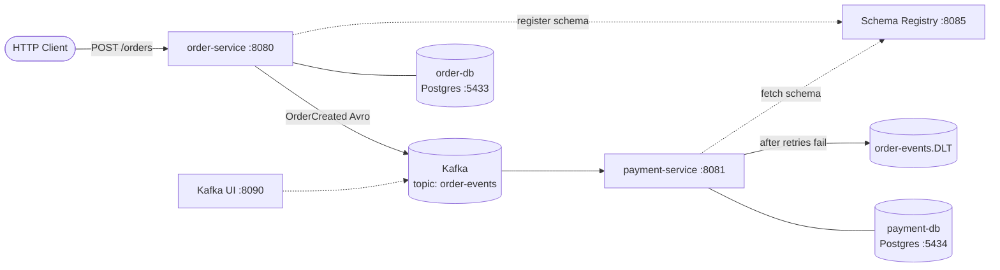

# Distributed Systems Playground

Hi! This is my learning project.

I started it to understand Kafka properly: not just read about it, but build something small, break it, and fix it. Kafka is still the heart of the project, but I'm using it as a base to explore more **architecture problems** and try new **technologies** as I learn them.

So this repo is less of a finished product and more of a notebook with working code. Each time I learn something new, I add it here as a "case": what the problem is, why it happens, how I solved it, and how you can try it yourself.

If you're learning the same things, I hope it helps you too.

---

## What it does right now

The setup is simple on purpose. There are two services that talk to each other through Kafka:



1. You send an order to **order-service**.
2. order-service turns it into an `OrderCreated` event and publishes it to Kafka.
3. **payment-service** picks the event up and processes it.
4. If something goes wrong, it retries a couple of times. If it still fails, the message goes to a **dead-letter topic** so it doesn't block everything else.

Each service has its own Postgres database. They aren't used yet, but they're ready for the next cases (Outbox and Saga).

---

## What I'm using

- **Java 25** with **Spring Boot 4.1** and Spring Kafka
- **Apache Kafka 4.0** in KRaft mode (no ZooKeeper)
- **Avro + Confluent Schema Registry** for event schemas
- **PostgreSQL 16**, one per service
- **Docker Compose** for the infrastructure
- **Kafka UI** (kafbat) to see what's actually happening in the topics
- **Gradle** (Kotlin DSL) and Lombok

```
kafka-demo/
├── docker/            # Kafka, Schema Registry, Kafka UI, 2x Postgres
├── shared-events/     # Avro schemas → generated Java classes, shared by both services
├── order-service/     # REST API + Kafka producer
└── payment-service/   # Kafka consumer + error handling
```

---

## Running it yourself

You'll need JDK 25 (and JDK 21 for `shared-events`, or Gradle can download it for you) and Docker.

**1. Start the infrastructure**

```bash
cd docker
docker compose up -d
```

This starts Kafka on `localhost:9092`, Schema Registry on http://localhost:8085, Kafka UI on http://localhost:8090, and the two databases on ports `5433` and `5434`.

**2. Publish the shared events library**

Both services use the generated Avro classes from `shared-events`, so publish it to your local Maven repo first:

```bash
cd shared-events
./gradlew publishToMavenLocal
```

Remember to run this again whenever you change an `.avsc` file.

**3. Start both services** (in separate terminals)

```bash
cd order-service   && ./gradlew bootRun   # port 8080
cd payment-service && ./gradlew bootRun   # port 8081
```

**4. Send an order**

```bash
curl -X POST http://localhost:8080/orders \
  -H "Content-Type: application/json" \
  -d '{"orderId": "1", "product": "laptop", "amount": 1200}'
```

(or run `order-service/src/main/requests.http` from IntelliJ)

If everything works, payment-service prints:

```
Payment received order: 1 for laptop amount: 1200.0
```

Then open Kafka UI and look around: the topic, the message, the registered schema. Seeing it there made a lot of things click for me.

---

## What I've learned so far

### 01 · Letting services talk without depending on each other

If order-service called payment-service directly over HTTP, then every time payment-service was down, orders would fail too. With Kafka in between, order-service just publishes an event and moves on. payment-service reads it whenever it's ready.

**Try it:** stop payment-service, send a few orders, then start it again. It catches up on everything it missed, because Kafka remembers where the `payment-group` consumer left off.

📁 `OrderProducer.java`, `PaymentConsumer.java`

### 02 · Agreeing on what an event looks like

With plain JSON, if the producer renames a field, nothing complains until the consumer breaks at runtime. So I moved to **Avro**: the event is defined once in `order-created.avsc`, Java classes are generated from it, and **Schema Registry** keeps track of every schema version.

Setting `specific.avro.reader=true` on the consumer means I get a real `OrderCreated` object instead of a generic record.

**Try it:** open http://localhost:8085/subjects and you'll see `order-events-value`.

📁 `shared-events/`, both `application.properties` files

### 03 · Dealing with messages that keep failing

One broken message can get retried forever and block every message behind it. To prevent that:

- `ErrorHandlingDeserializer` catches messages that can't even be read, so they don't crash the consumer.
- `DefaultErrorHandler` retries **2 times, 1 second apart**.
- If it still fails, `DeadLetterPublishingRecoverer` moves the message to `order-events.DLT`, where I can look at it later.

**Try it:** throw an exception inside `PaymentConsumer`, send an order, and watch it land in the DLT in Kafka UI.

📁 `payment-service/.../config/KafkaErrorConfig.java`

---

## What I want to learn next

This list will keep changing, but these are the things I'm curious about:

**Making things reliable**
- [ ] **Transactional Outbox**: save the order and the event together, so I never end up with "saved to the DB, but the event got lost"
- [ ] **Idempotent consumer**: handle the same message arriving twice
- [ ] **Saga pattern**: a transaction that spans order and payment, and what happens when one step fails
- [ ] **Exactly-once**: Kafka transactions and the idempotent producer

**Going deeper into Kafka**
- [ ] **Message keys and ordering**: right now I send messages without a key, so events for the same order can arrive out of order
- [ ] **Partitions and scaling**: running several consumers in the same group
- [ ] **Schema evolution**: adding a field without breaking the other service
- [ ] **Money types**: moving `amount` from `double` to Avro's `decimal` (or a `long` in cents), which is also a good schema evolution exercise
- [ ] **Non-blocking retries** with `@RetryableTopic`
- [ ] **Kafka Connect / Debezium (CDC)**: there's already a commented-out Connect service in the compose file waiting for this
- [ ] **Kafka Streams**: live aggregations, like total sales per product

**The bigger picture**
- [ ] CQRS and Event Sourcing
- [ ] API Gateway and service discovery
- [ ] Caching with Redis
- [ ] Observability: tracing with OpenTelemetry, Prometheus/Grafana, correlation IDs
- [ ] Integration tests with Testcontainers
- [ ] Securing Kafka (SASL/SSL)
- [ ] Running everything with a single `docker compose up`

---

## Things I'm keeping in mind

Small notes for my future self:

- **Why Kafka has two listeners:** my Spring apps run on my machine and connect through `localhost:9092`. Kafka UI and Schema Registry run inside Docker, and inside a container `localhost` means the container itself, so they use `kafka:29092` instead.
- **No ZooKeeper anymore:** Kafka 4.0 runs in KRaft mode, so one node is both broker and controller.
- **The `amount` type:** `OrderRequest.amount` used to be an `int`, so a value like `19.99` was silently cut to `19` before it even reached Avro. I changed it to `double` to match the schema. But `double` still isn't ideal for money, because it can't store values like `0.1` exactly. That's on my list below.

---

## How I add a new case

So the notes stay consistent, every new topic gets its own branch (`case/NN-short-name`) and a short write-up here:

```markdown
### NN · <What I learned>

What went wrong, and why it happens.
How I solved it, and what else I could have used.
What it costs (complexity, latency, extra infrastructure).

**Try it:** steps to see the problem and the fix.

📁 files involved
```

Then I tick it off in the list above. 🙂

---

Feedback, corrections and suggestions are very welcome. I'm learning, and I'd love to hear if I got something wrong.
